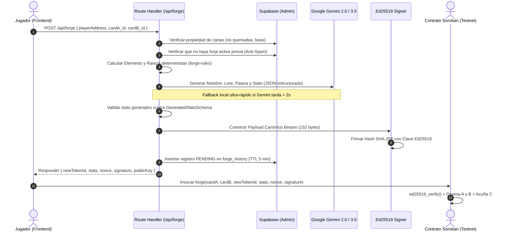

# Módulo del Oráculo: IA Generativa & Firma Criptográfica Ed25519 (`/api/forge`)

El Oráculo de Stellar Runes es el componente de enlace entre el mundo de la Inteligencia Artificial Generativa y la seguridad criptográfica determinista de la red Stellar (Soroban).

---

## 1. ¿Por qué es necesario un Oráculo?

Los contratos inteligentes en Soroban ejecutan código WebAssembly (WASM) dentro de un entorno aislado y determinista:
1. Un Smart Contract **no puede realizar peticiones HTTP externas** para consultar modelos como Google Gemini.
2. Cada nodo validador de Stellar debe ejecutar exactamente las mismas instrucciones y alcanzar el mismo estado global.
3. Para introducir atributos generados por IA (nombre, lore, habilidades y distribución de stats) en la blockchain, se utiliza el **Patrón de Oráculo Criptográfico**:
   - El servidor calcula y valida los datos fuera de cadena (*off-chain*).
   - El servidor firma digitalmente el payload canónico con una clave privada conocida por el contrato (`ORACLE_SECRET_KEY`).
   - El contrato Soroban verifica la firma con la función nativa `env.crypto().ed25519_verify()` antes de ejecutar la quema y acuñación (*Burn & Mint*).

---

## 2. Flujo del Protocolo de Forja

---

## 3. Especificación del Payload Canónico (152 Bytes)

Para que el contrato Soroban en Rust pueda verificar la firma de forma idéntica, el payload binario debe respetar rigurosamente este orden y codificación de bytes:

| Campo | Tipo | Tamaño | Descripción |
| :--- | :--- | :---: | :--- |
| **Network ID** | SHA-256 | 32 bytes | Hash SHA-256 del passphrase de la red (ej. `Test SDF Network ; September 2015`). Previene ataques de retransmisión entre Testnet y Mainnet. |
| **Contract ID** | Raw Ed25519 | 32 bytes | Dirección del contrato Soroban (`C...`) decodificada con `StrKey.decodeContract`. Previene reutilización en otros contratos. |
| **Player Address** | Raw Ed25519 | 32 bytes | Clave pública del jugador (`G...`) decodificada con `StrKey.decodeEd25519PublicKey`. Previene secuestro de firmas por terceros. |
| **cardA_id** | u64 Big-Endian | 8 bytes | Token ID de la primera carta a quemar (`to_be_bytes()`). |
| **cardB_id** | u64 Big-Endian | 8 bytes | Token ID de la segunda carta a quemar (`to_be_bytes()`). |
| **newTokenId** | u64 Big-Endian | 8 bytes | Token ID reservado para la nueva carta híbrida. |
| **Stats Hash** | SHA-256 | 32 bytes | Hash de la cadena canónica: `${name}\|${atk}\|${def}\|${element}\|${metadataUri}`. |
| **Nonce** | u64 Big-Endian | 8 bytes | Identificador único temporal para evitar ataques de repetición (*replay attacks*). |
| **TOTAL** | | **152 bytes** | |

El hash SHA-256 resultante de estos 152 bytes es firmado con la función Ed25519 estándar de Stellar:
$$\text{Signature} = \text{Ed25519\_Sign}(\text{PrivateKey}_{\text{oracle}}, \text{SHA256}(\text{Payload}_{152}))$$

---

## 4. Estrategia de Resiliencia ante Fallos de IA

Para asegurar que una demostración en vivo de la hackathon nunca se congele debido a latencias externas de red o límites de cuota de API:
1. **Timeout Defensivo**: La llamada a Gemini utiliza `Promise.race` con un límite estricto de **2 segundos**.
2. **Fallback Determinista**: Si la IA no responde a tiempo o arroja un error HTTP 429/500, se invoca automáticamente `generateFallbackFusionText()`, la cual calcula inmediatamente un nombre noble y stats equilibrados que cumplen al 100% con los esquemas de validación.
