# Módulo 6: Pipeline de Transacciones & Ensamblaje Soroban (Integración Total)

El **Módulo 6** es el motor central de orquestación end-to-end de Stellar Runes. Conecta la experiencia de usuario en el Altar de Forja con el Oráculo criptográfico (Módulo 4), el contrato inteligente en Soroban Testnet (Módulo 5), la firma en billeteras Web3 (Módulo 2) y la sincronización transaccional off-chain en Supabase (Módulo 1).

---

## 1. Ficha Técnica del Módulo

| Parámetro | Detalle |
| :--- | :--- |
| **Nivel de Complejidad** | 6 / 6 (Máxima) |
| **SDK Central** | `@stellar/stellar-sdk` v17.1.0 |
| **Punto de Enlace RPC** | `https://soroban-testnet.stellar.org` |
| **Red** | Stellar Testnet (`Test SDF Network ; September 2015`) |
| **Contract ID Activo** | `CAXAZJAJXA4CU2GYK3TRIGGDZTOCJGNX2FFC7CZEITN2TG7IPGSX7NVD` |
| **Servicio Principal** | `src/modules/forge/application/forge-pipeline.ts` |
| **Endpoint de Sincronización** | `src/app/api/sync-forge/route.ts` |
| **Suite de Tests** | `src/modules/forge/application/forge-pipeline.test.ts` (9 tests unitarios/integración) |

---

## 2. Diagrama de Arquitectura End-to-End

```mermaid
sequenceDiagram
    autonumber
    actor Jugador as Jugador (Altar UI)
    participant Workbench as useForgeWorkbench
    participant Pipeline as forge-pipeline.ts
    participant OracleAPI as API /api/forge
    participant SorobanRPC as Soroban Testnet RPC
    participant Wallet as Freighter / WalletsKit / QuickPlay
    participant SyncAPI as API /api/sync-forge
    participant Supabase as Supabase DB

    Jugador->>Workbench: Clic "¡INICIAR FORJA ATÓMICA!"
    Workbench->>Pipeline: executeForgePipeline(...)
    
    rect rgb(20, 30, 60)
        note over Pipeline,OracleAPI: FASE 1: Consulta y Firma del Oráculo
        Pipeline->>OracleAPI: POST /api/forge { playerAddress, cardA, cardB }
        OracleAPI-->>Pipeline: { newTokenId, stats, nonce, oracleSignature }
    end

    rect rgb(25, 45, 75)
        note over Pipeline,SorobanRPC: FASE 2 & 3: Simulación Pre-flight y Ensamblaje
        Pipeline->>SorobanRPC: getAccount(playerAddress)
        Pipeline->>Pipeline: Construir rawTx con Operation.invokeContractFunction('forge')
        Pipeline->>SorobanRPC: simulateTransaction(rawTx)
        SorobanRPC-->>Pipeline: SimulationResponse (Footprint, Auth, Gas)
        Pipeline->>Pipeline: rpc.assembleTransaction(rawTx, sim).build()
    end

    rect rgb(45, 30, 65)
        note over Pipeline,Wallet: FASE 4: Autorización con Billetera
        Pipeline->>Wallet: signTransaction(preparedTx.toXDR())
        Wallet-->>Pipeline: signedTxXDR
        Pipeline->>Pipeline: TransactionBuilder.fromXDR(signedTxXDR, TESTNET)
    end

    rect rgb(20, 50, 40)
        note over Pipeline,SorobanRPC: FASE 5: Emisión y Polling en Ledger
        Pipeline->>SorobanRPC: sendTransaction(signedTx)
        loop Polling asíncrono con Backoff (1.5s - 3s, timeout 35s)
            Pipeline->>SorobanRPC: getTransaction(txHash)
            SorobanRPC-->>Pipeline: txStatus (PENDING -> SUCCESS)
        end
    end

    rect rgb(35, 45, 60)
        note over Pipeline,Supabase: FASE 6: Sincronización Off-chain y Revelación
        Pipeline->>SyncAPI: POST /api/sync-forge { txHash, playerAddress, ... }
        SyncAPI->>SorobanRPC: getTransaction(txHash) [Server Verification]
        SyncAPI->>Supabase: UPDATE user_cards (is_burned = true)
        SyncAPI->>Supabase: INSERT user_cards (new forged card)
        SyncAPI->>Supabase: UPDATE forge_history (status = CONFIRMED)
        SyncAPI-->>Pipeline: { success: true, card }
    end

    Pipeline-->>Workbench: { txHash, newTokenId, newCard, ledger }
    Workbench->>Jugador: Abre RevealModal(newCard) con enlace en vivo a StellarExpert
```

---

## 3. Alineación con las Directrices de `.agents/skills`

### A. `.agents/skills/dapp/SKILL.md` (Patrón de Oro de Soroban)
* **Pre-flight simulation obligatoria:** Se ejecuta `simulateTransaction` antes de cualquier llamada a firma para calcular exactamente la huella de almacenamiento (*footprint*) y presupuesto de gas de Soroban.
* **Ensamblaje estricto de recursos:** Se invoca `rpc.assembleTransaction(rawTx, sim).build()`, garantizando que la transacción contenga las claves de ledger necesarias (`DataKey::Card(a)`, `DataKey::Card(b)`, `DataKey::Card(new)`).
* **Manejo resiliente de billeteras:** Captura cancelaciones del usuario (`User rejected / UserDeclinedError`) sin congelar la interfaz ni dejar el altar en estado infinito de carga.

### B. `.agents/skills/data/SKILL.md` (Manejo de Errores RPC y Polling)
* **Inspección de simulación:** Valida `rpc.Api.isSimulationError(sim)` y extrae mensajes traducidos claros.
* **Polling resiliente:** Bucle `pollTransactionStatus` con backoff exponencial (`interval = min(interval * 1.2, 3000)`) y tiempo límite de seguridad de 35 segundos.

### C. `.agents/skills/smart-contracts/` (Empaquetado Canónico ScVal)
* Los 7 argumentos del método `forge` en Rust se construyen canónicamente:
  1. `caller`: `Address`
  2. `card_a`: `u64`
  3. `card_b`: `u64`
  4. `new_token_id`: `u64`
  5. `stats`: Struct `CardStatsInput` empaquetado como `scvMap` con claves ordenadas (`atk`, `def`, `element`, `metadata_uri`, `name`, `rarity`, `stats_hash`).
  6. `signature`: `BytesN<64>`
  7. `nonce`: `u64`

### D. `.agents/skills/clean-architecture/SKILL.md` & `supabase-postgres-best-practices/SKILL.md`
* **Capa de Aplicación:** `forge-pipeline.ts` orquesta el caso de uso sin acoplar la UI a detalles de transporte de red.
* **Verificación Server-Side:** `/api/sync-forge` valida directamente contra Soroban RPC que la transacción esté en `SUCCESS` antes de alterar la base de datos off-chain.

---

## 4. Matriz de Errores y Diagnóstico de Ledger

| Código de Error Soroban | Mensaje en Español al Usuario |
| :--- | :--- |
| `Error(Contract, #1)` | *El contrato ya ha sido inicializado.* |
| `Error(Contract, #2)` | *El contrato de forja no está inicializado.* |
| `Error(Contract, #3)` | *Operación no autorizada en el contrato.* |
| `Error(Contract, #4)` | *Una de las cartas seleccionadas no existe en el ledger de Stellar Soroban.* |
| `Error(Contract, #5)` | *No eres el propietario registrado en la blockchain para estas cartas.* |
| `Error(Contract, #6)` | *No puedes fusionar una carta consigo misma.* |
| `Error(Contract, #7)` | *El nonce de la forja ya fue utilizado o ha expirado. Genera una nueva forja.* |
| `Error(Contract, #8)` / `ed25519` | *Fallo en la validación criptográfica de la firma del Oráculo.* |
| `Error(Contract, #9)` | *El mazo inicial ya fue reclamado para esta cuenta.* |
| `Error(Contract, #10)` | *El identificador del token ya existe en la blockchain.* |
| `Error(Contract, #11)` | *Los atributos de ataque o defensa son inválidos para la regla de forja.* |
| Rechazo en Billetera | *La firma fue cancelada o rechazada en la billetera.* |

---

## 5. Resultados de Validación y Verificación

1. **TypeScript Check:**
   * `npx tsc --noEmit`: 0 errores.
2. **Vitest Suite:**
   * 28 de 28 tests pasando (3 archivos de pruebas con 100% de cobertura funcional).
3. **Rust Contract Tests:**
   * 7 de 7 tests pasando en `contracts/forge_contract` (`cargo test`).
4. **Verificación On-chain:**
   * Probado con contrato desplegado en Testnet: `CAXAZJAJXA4CU2GYK3TRIGGDZTOCJGNX2FFC7CZEITN2TG7IPGSX7NVD`.
   * Enlace en `RevealModal` directo a StellarExpert Testnet.
