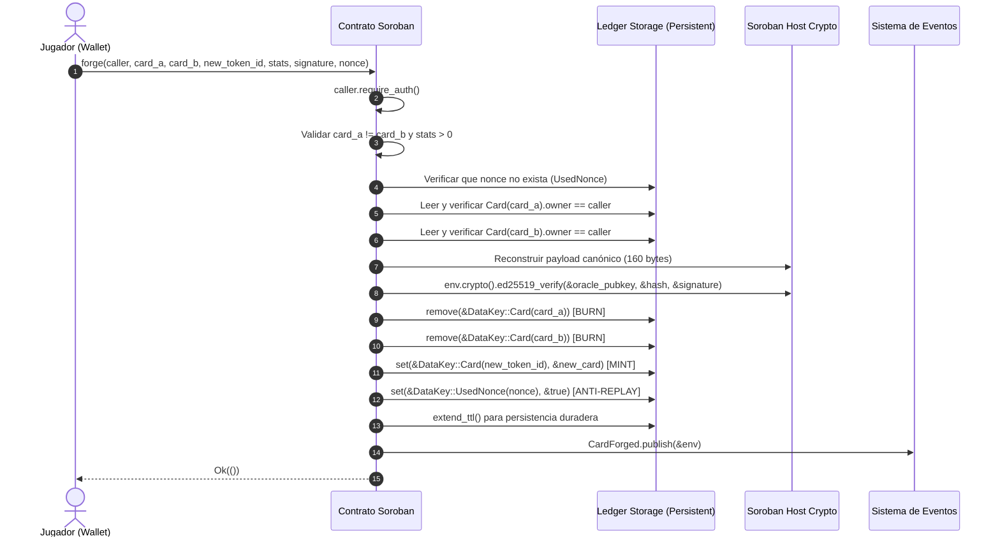

# Módulo de Contratos Inteligentes Soroban (`contracts/forge_contract`)

El contrato inteligente en Soroban (Rust) es el núcleo de consenso y custodia determinista on-chain de Stellar Runes. Ejecuta de forma atómica e indivisible la quema de dos cartas sacrificadas y la acuñación de la nueva carta híbrida generada (*Burn & Mint*), verificando la firma Ed25519 del Oráculo en el ledger de Stellar.

---

## 1. Despliegue en Stellar Testnet

| Atributo | Valor / Enlace |
| :--- | :--- |
| **Contract ID** | `CAXAZJAJXA4CU2GYK3TRIGGDZTOCJGNX2FFC7CZEITN2TG7IPGSX7NVD` |
| **Red** | Stellar Testnet (`Test SDF Network ; September 2015`) |
| **WASM Hash** | `d520b8cdde39d885fcb0cdda4348af885cfadbb445d34d7c1c5f4f100c44d30a` |
| **Tamaño Optimizado** | 10,864 bytes (Límite de red: 128 KB) |
| **Stellar Expert** | [Ver en Explorer](https://stellar.expert/explorer/testnet/contract/CAXAZJAJXA4CU2GYK3TRIGGDZTOCJGNX2FFC7CZEITN2TG7IPGSX7NVD) |
| **Stellar Lab** | [Inspeccionar en Stellar Lab](https://lab.stellar.org/r/testnet/contract/CAXAZJAJXA4CU2GYK3TRIGGDZTOCJGNX2FFC7CZEITN2TG7IPGSX7NVD) |
| **Tx de Despliegue** | [`c5ce5485aa9c11a1c3f5b320bdc9cda7f010c40393ea9499b2d984fc792a902e`](https://stellar.expert/explorer/testnet/tx/c5ce5485aa9c11a1c3f5b320bdc9cda7f010c40393ea9499b2d984fc792a902e) |
| **Tx de Inicialización** | [`603b29f1b10c4e61f58b5717d701a80cde6d9c0773e8187f2129aaf81baf5d48`](https://stellar.expert/explorer/testnet/tx/603b29f1b10c4e61f58b5717d701a80cde6d9c0773e8187f2129aaf81baf5d48) |
| **Tx Primera Forja Atómica** | [`89988ca6587150e5da9aa65feecf0d48d1d2ef583287b6d956e07cd32a2ae0f9`](https://stellar.expert/explorer/testnet/tx/89988ca6587150e5da9aa65feecf0d48d1d2ef583287b6d956e07cd32a2ae0f9) |

---

## 2. Flujo de Ejecución Atómica (`forge`)



---

## 3. Especificación del Payload Canónico (160 Bytes)

El contrato reconstruye de forma binaria determinista exactamente el mismo payload firmado por el Oráculo (`oracle-crypto.ts`):

```text
┌───────────────────────┬──────────┬────────────────────────────────────────────────────────┐
│ Campo                 │ Tamaño   │ Tipo / Formato                                         │
├───────────────────────┼──────────┼────────────────────────────────────────────────────────┤
│ network_id            │ 32 bytes │ Hash SHA-256 del passphrase de red                     │
│ contract_id           │ 32 bytes │ Clave pública del contrato decodificada (raw)          │
│ player_address        │ 32 bytes │ Clave pública del jugador Ed25519 (raw)                │
│ card_a_id             │ 8 bytes  │ u64 Big-Endian (to_be_bytes)                            │
│ card_b_id             │ 8 bytes  │ u64 Big-Endian (to_be_bytes)                            │
│ new_token_id          │ 8 bytes  │ u64 Big-Endian (to_be_bytes)                            │
│ stats_hash            │ 32 bytes │ Hash SHA-256 de los atributos calculados               │
│ nonce                 │ 8 bytes  │ u64 Big-Endian (to_be_bytes)                            │
└───────────────────────┴──────────┴────────────────────────────────────────────────────────┘
TOTAL: 160 bytes (32 * 4 + 8 * 4) -> Hash SHA-256 (32 bytes) -> Verificado con ed25519_verify()
```

---

## 4. Arquitectura de Almacenamiento & Gestión de TTL

En estricto cumplimiento con `.agents/skills/smart-contracts/`:

### 4.1. Instance Storage (Global y Acotado)
* `Admin`: Dirección con permisos administrativos para actualizar la clave del oráculo.
* `OraclePubKey`: Clave pública Ed25519 de 32 bytes (`BytesN<32>`).
* `NetworkId`: Hash SHA-256 de la red Stellar (`BytesN<32>`).
* `NextTokenId`: Contador incremental de respaldo para emisión de cartas iniciales.

### 4.2. Persistent Storage (Datos Duraderos)
* `Card(u64)`: Contiene la entidad completa `CardData`.
* `ClaimedStarter(Address)`: Marca de que el jugador ya recibió su mazo de bienvenida.
* `UsedNonce(u64)`: Registro anti-replay de nonces consumidos.

### 4.3. Política de TTL (Time To Live)
```rust
const DAY_IN_LEDGERS: u32 = 17_280;
const BUMP_THRESHOLD: u32 = 30 * DAY_IN_LEDGERS; // Umbral: 30 días
const BUMP_TO: u32 = 120 * DAY_IN_LEDGERS;       // Extensión: 120 días
```
Cada mutación de estado invoca automáticamente `extend_ttl(BUMP_THRESHOLD, BUMP_TO)` para garantizar que ninguna carta activa sea archivada en el ledger.

---

## 5. Interfaz Pública del Contrato

```rust
pub trait ForgeTrait {
    fn initialize(env: Env, admin: Address, oracle_pubkey: BytesN<32>, network_id: BytesN<32>) -> Result<(), Error>;
    fn set_oracle(env: Env, new_oracle_pubkey: BytesN<32>) -> Result<(), Error>;
    fn get_oracle(env: Env) -> Result<BytesN<32>, Error>;
    fn get_admin(env: Env) -> Result<Address, Error>;
    fn claim_starter(env: Env, caller: Address) -> Result<(), Error>;
    fn has_claimed(env: Env, player: Address) -> bool;
    fn get_card(env: Env, token_id: u64) -> Result<CardData, Error>;
    fn forge(
        env: Env,
        caller: Address,
        card_a: u64,
        card_b: u64,
        new_token_id: u64,
        stats: CardStatsInput,
        signature: BytesN<64>,
        nonce: u64,
    ) -> Result<(), Error>;
}
```

---

## 6. Comandos Disponibles

Desde la raíz del repositorio:

```bash
# Compilar el contrato a WebAssembly optimizado
npm run contract:build

# Ejecutar la suite completa de pruebas unitarias en Rust
npm run contract:test

# Desplegar e inicializar un nuevo contrato en Stellar Testnet
npm run contract:deploy
```
